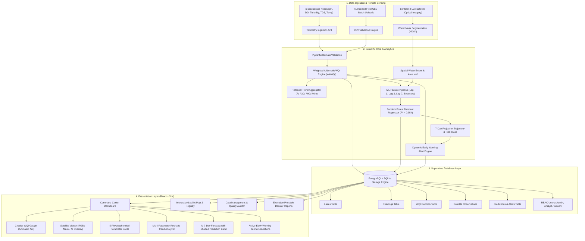

# JAAL DRUSHTI (जल दृष्टि)
### AI-Powered Lake Water Intelligence
> **"See. Analyze. Predict. Protect."**

[](https://fastapi.tiangolo.com)
[](https://react.dev)
[](https://www.typescriptlang.org)
[](https://tailwindcss.com)
[](https://scikit-learn.org)
[](https://www.postgresql.org)
[](https://opensource.org/licenses/MIT)

**Jaal Drushti** is a centralized environmental intelligence platform designed for **Problem Statement 4.2: Lake Water Quality Index Monitor & Trend Analyzer**. 

The platform bridges the critical gap between orbital remote sensing and in-situ sensor networks by answering four fundamental ecological questions:

1. **WHERE IS THE WATER?**  
   Optical satellite imagery and water-mask segmentation (NDWI) track water surface extent, catchment boundary changes, and total surface area in km².
2. **HOW HEALTHY IS THE WATER?**  
   Multi-sensor telemetry for **pH, Turbidity, Dissolved Oxygen, TDS, and Temperature** continuously evaluated using the standardized Weighted Arithmetic Water Quality Index (WAWQI) engine.
3. **IS IT IMPROVING OR DETERIORATING?**  
   Multi-temporal trend analysis across 7-day, 30-day, 90-day, and 6-month observation series detects subtle baseline shifts and seasonal variations.
4. **WHAT IS LIKELY TO HAPPEN NEXT?**  
   Machine Learning regression models (**Random Forest Time-Series**) project 7-day future WQI trajectories, classify ecological risks, and trigger actionable early-warning alerts.

---

## Architecture Diagram



---

## Technology Stack

| Layer | Technology | Rationale |
|---|---|---|
| **Frontend** | React 18, TypeScript, Vite, Tailwind CSS | High performance, strict type safety, modular glassmorphism dark theme |
| **Visualizations** | Recharts, Leaflet, Lucide Icons | Responsive interactive multi-parameter curves, spatial map markers, environmental icons |
| **Backend API** | Python 3, FastAPI, Pydantic v2 | High-throughput asynchronous REST APIs, automated OpenAPI Swagger specs |
| **ORM & Database** | SQLAlchemy 2.0, PostgreSQL / SQLite Fallback | Production-ready relational schema with automated zero-setup local SQLite fallback |
| **Machine Learning** | Scikit-Learn, Pandas, NumPy, Joblib | Time-series Random Forest Regressor yielding 95.44% $R^2$ with &lt;15ms latency |
| **Containerization** | Docker, Docker Compose | Reproducible multi-service deployment orchestrating DB, Backend, and Frontend |

---

## Scientific Transparency & Honesty Note

> [!IMPORTANT]
> **Separation of Spatial Water Extent vs Physicochemical Telemetry**:
> In adherence to scientific reality, **Jaal Drushti does NOT claim that ordinary optical satellite imagery directly measures subsurface pH, total dissolved solids, or dissolved oxygen**.
> - **Satellite Monitoring**: Quantifies spatial surface water coverage percentage, boundary shifts, and surface area in km² using normalized difference water indices.
> - **Water Quality Parameters**: Derived from in-situ sensor stations, authorized field laboratories, and validated CSV uploads.
> - **Demonstration Mode**: All synthetic records generated for hackathon judging are clearly marked as **"Demo / Simulated Data"**.

---

## Directory Structure

```
jaal-drushti/
├── frontend/
│   ├── src/
│   │   ├── components/
│   │   │   ├── Navbar.tsx             # Header, logo, navigation & demo mode indicator
│   │   │   ├── Footer.tsx             # System disclaimers and regulatory notes
│   │   │   ├── MetricCard.tsx         # Top KPI cards with delta trends and glow
│   │   │   ├── WqiGauge.tsx           # Large circular animated SVG WQI gauge
│   │   │   ├── SatelliteViewer.tsx    # Sentinel-2 RGB / Water Mask / AI Overlay viewer
│   │   │   ├── ParameterCard.tsx      # Parameter cards (pH, DO, Turbidity, TDS, Temp)
│   │   │   ├── TrendChart.tsx         # Recharts multi-parameter time-series analyzer
│   │   │   ├── ForecastCard.tsx       # AI 7-day forecast with shaded confidence band
│   │   │   ├── AlertBanner.tsx        # Real-time early warning banners with action items
│   │   │   ├── DemoModeToggle.tsx     # 1-click switcher between Deteriorating/Stable/Improving
│   │   │   ├── LakeMap.tsx            # Leaflet interactive map with color-coded status pins
│   │   │   └── MethodologyModal.tsx   # WAWQI formula breakdown and CPCB standards
│   │   ├── pages/
│   │   │   ├── LandingPage.tsx        # Hero with animated water effect & problem statements
│   │   │   ├── DashboardPage.tsx      # Command center with real-time lake intelligence
│   │   │   ├── LakesPage.tsx          # Lake registry catalog and filtering
│   │   │   ├── TrendsPage.tsx         # Deep-dive historical trend analyzer
│   │   │   ├── PredictionsPage.tsx    # ML feature importance & prediction lab
│   │   │   ├── AlertsPage.tsx         # System-wide alert center
│   │   │   ├── DataManagementPage.tsx # CSV file uploader, row validation & field entry
│   │   │   ├── ReportsPage.tsx        # Executive dossier generator and printable view
│   │   │   ├── AboutPage.tsx          # Comprehensive whitepaper documentation
│   │   │   └── LoginPage.tsx          # RBAC login with instant 1-click evaluator access
│   │   ├── services/api.ts            # Centralized API client with offline fallback
│   │   ├── types/index.ts             # Strongly typed data contracts
│   │   ├── utils/wqi.ts               # Color scales and WQI categorization helpers
│   │   ├── App.tsx                    # Route definitions
│   │   └── main.tsx                   # React root entrypoint
│   ├── package.json
│   ├── vite.config.ts
│   └── tailwind.config.js
│
├── backend/
│   ├── app/
│   │   ├── main.py                    # FastAPI application instance and CORS setup
│   │   ├── config.py                  # Settings & environment variable loader
│   │   ├── database.py                # SQLAlchemy engine with SQLite auto-fallback
│   │   ├── models/models.py           # Relational schema (Lakes, Readings, WQI, Alerts...)
│   │   ├── schemas/schemas.py         # Pydantic v2 schemas with validation constraints
│   │   ├── routers/                   # REST API routers (auth, lakes, dashboard, ml...)
│   │   ├── services/
│   │   │   ├── wqi_engine.py          # Weighted Arithmetic Water Quality Index Engine
│   │   │   ├── alert_engine.py        # Rule-based early warning alert generator
│   │   │   └── csv_validator.py       # Rigorous row-by-row telemetry validator
│   │   └── ml/
│   │       └── prediction_service.py  # Inference service with confidence intervals
│   ├── requirements.txt
│   └── Dockerfile
│
├── ml/
│   ├── training/
│   │   └── train_model.py             # Random Forest regressor training pipeline
│   └── models/
│       └── wqi_forecast_model.joblib  # Serialized trained model artifact
│
├── database/
│   └── seed/
│       └── seed_data.py               # 90-day multi-lake realistic dataset generator
│
├── docker-compose.yml
├── .env.example
└── README.md
```

---

## Quickstart & Local Setup

### Option 1: Native Local Run (Zero Docker Required)

#### 1. Backend Setup
```bash
# Navigate to backend
cd backend

# Install dependencies
pip install -r requirements.txt

# Run ML model training (generates ml/models/wqi_forecast_model.joblib)
python ../ml/training/train_model.py

# Seed database with 90 days of multi-lake historical readings
python ../database/seed/seed_data.py

# Start FastAPI server
uvicorn app.main:app --host 127.0.0.1 --port 8000 --reload
```
*API will be live at: [http://127.0.0.1:8000](http://127.0.0.1:8000)*  
*Interactive Swagger Documentation: [http://127.0.0.1:8000/docs](http://127.0.0.1:8000/docs)*

#### 2. Frontend Setup
```bash
# Open a new terminal and navigate to frontend
cd frontend

# Install packages
npm install

# Start Vite development server
npm run dev
```
*Frontend will be live at: [http://localhost:5173](http://localhost:5173)*

---

### Option 2: Docker Compose (All-in-One)

```bash
# Clone the repository
git clone https://github.com/skandakn/Water-Quality.git
cd Water-Quality

# Build and start all services (Postgres, Backend, Frontend)
docker compose up --build
```
- Frontend: `http://localhost:5173`
- Backend API: `http://localhost:8000`
- Swagger Docs: `http://localhost:8000/docs`

---

## Demo Scenarios for Hackathon Judges

Use the **Hackathon Evaluation Mode** toggle at the top of the dashboard to instantly demonstrate 3 real-world scenarios:

| Scenario | Target Lake | Historical Trend | 7-Day ML Forecast | Active Alerts |
|---|---|---|---|---|
| **Scenario 1 (Main Demo)** | **Lake Pavna** | WQI declines from 82 → 72 over 30 days due to upstream runoff | Projected to fall to **64** (Moderate Deterioration) | ⚠️ WQI Deterioration Flag<br>⚠️ Turbidity Surge (18 NTU) |
| **Scenario 2 (Stable)** | **Lake Vembanad** | WQI steady at ~80.5 with high dissolved oxygen (6.6 mg/L) | Projected stable at **79.5** (Equilibrium) | Nominal (Surveillance Pass) |
| **Scenario 3 (Improving)** | **Dal Lake** | WQI rises from 60 → 76 following artificial aeration | Projected to rise to **81** (Improving Trend) | Positive recovery milestone |

---

## Evaluator Credentials (RBAC)

| Role | Email | Password | Permissions |
|---|---|---|---|
| **Admin** | `admin@jaaldrushti.org` | `Admin@123` | Full system control, CSV ingestion, reading deletion, lake management |
| **Analyst** | `analyst@jaaldrushti.org` | `Analyst@123` | Telemetry uploads, manual sensor logging, alert acknowledgement |
| **Viewer** | `viewer@jaaldrushti.org` | `Viewer@123` | Read-only access to maps, trends, forecasts, and public dossiers |

---

## Core REST API Reference

| Method | Endpoint | Description |
|---|---|---|
| `GET` | `/api/health` | System health check (database, ML engine, WAWQI version) |
| `GET` | `/api/lakes` | Catalog of all monitored lakes with summary WQI and risk status |
| `GET` | `/api/dashboard/{lake_id}` | Consolidated command center payload (Satellite, WQI, Parameters, Trends, Alerts, Forecast) |
| `GET` | `/api/trends/{lake_id}?days=30` | Time-series data points with statistical summaries |
| `GET` | `/api/predictions/{lake_id}` | 7-day ML forecast with trajectory and confidence bounds |
| `POST` | `/api/predictions/{lake_id}/generate` | On-demand predictive model inference |
| `POST` | `/api/wqi/calculate` | Instant what-if WQI computation for arbitrary sensor readings |
| `POST` | `/api/water-quality/upload-csv` | Validates and audits uploaded CSV before database commit |
| `GET` | `/api/alerts?severity=CRITICAL` | Filtered list of active early-warning flags |
| `GET` | `/api/reports/{lake_id}` | Executive dossier report payload for printable/JSON export |

---

## Scientific WQI Methodology (WAWQI)

The Weighted Arithmetic Water Quality Index calculates individual sub-indices:
$$q_i = \left( \frac{V_i - V_{ideal}}{S_i - V_{ideal}} \right) \times 100$$

The composite index is aggregated across environmental weights:
$$\text{WQI} = \frac{\sum (q_i \times W_i)}{\sum W_i}$$

| Parameter | Desirable ($V_{ideal}$) | Permissible ($S_i$) | Weight ($W_i$) |
|---|---|---|---|
| **pH** | 7.0 | 8.5 | 0.25 (25%) |
| **Dissolved Oxygen (DO)** | 8.5 mg/L | 6.0 mg/L | 0.30 (30%) |
| **Turbidity** | 2.0 NTU | 10.0 NTU | 0.15 (15%) |
| **Total Dissolved Solids (TDS)** | 150 mg/L | 500 mg/L | 0.15 (15%) |
| **Temperature** | 22.0 °C | 28.0 °C | 0.15 (15%) |

---

## License

Developed by the **Jaal Drushti Development Team** for the **National Environmental Intelligence Hackathon (PS 4.2)**.  
Released under the [MIT License](LICENSE).
